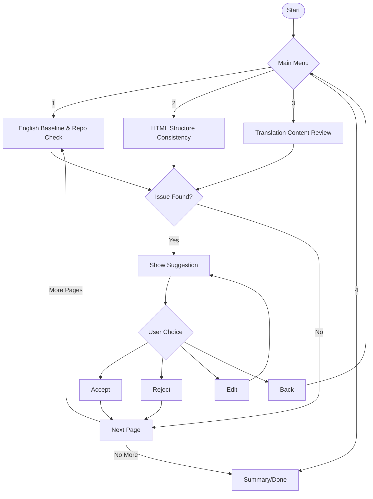

# Audit Agent Workflow (LangGraph Style)

This diagram illustrates the modular, interactive audit workflow for translation and content consistency, designed for a LangGraph agent implementation.

- Each phase is a node; user choices drive navigation.
- Accept, Reject, Edit, and Back are supported at each suggestion.
- The flow supports modular extension and interactive review.
